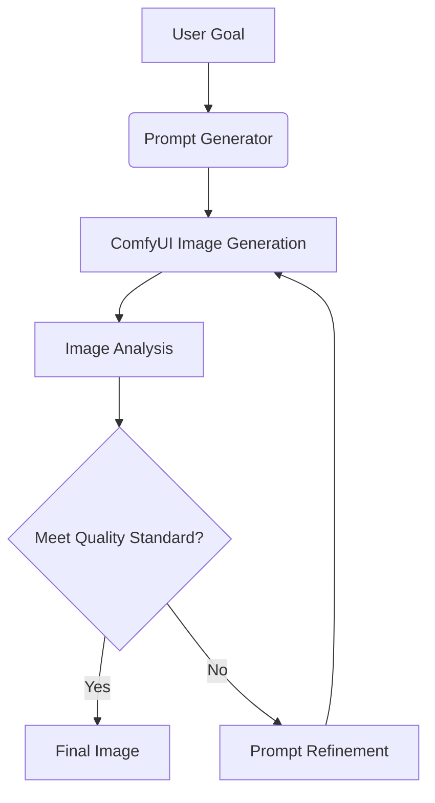

```markdown
# Iterative Image Generation & Refinement System


An automated system for iterative text-to-image generation using ComfyUI and AI-powered visual analysis with Ollama's vision models. This system helps refine image generation prompts through multiple iterations of generation and analysis.

## Features

- 🖼️ **ComfyUI Integration**: Direct integration with ComfyUI's API for stable diffusion image generation
- 🔍 **Visual Analysis**: Uses Ollama's llama3.2-vision model for detailed image analysis
- 🔄 **Iterative Refinement**: Automated prompt improvement based on visual feedback
- 📊 **Progress Tracking**: JSON-based logging of all iterations with prompts and analyses
- 🧠 **Customizable Workflows**: Easily modify the ComfyUI workflow template
- 🤖 **AI-Powered Suggestions**: LLM-based prompt refinement using Ollama's text models

## Requirements

- Python 3.8+
- [Ollama](https://ollama.ai/) (with llama3.2-vision and llama3 models)
- [ComfyUI](https://github.com/comfyanonymous/ComfyUI) running locally
- 8GB+ VRAM (for stable diffusion image generation)
- 16GB+ RAM (for vision model analysis)

## Installation

1. **Clone Repository**
```bash
git clone https://github.com/yourusername/iterative-image-generation.git
cd iterative-image-generation
```

2. **Set Up Environment**
```bash
python -m venv venv
source venv/bin/activate  # Linux/Mac
venv\Scripts\activate     # Windows
```

3. **Install Dependencies**
```bash
pip install -r requirements.txt
```

4. **Configure Services**
```bash
# Start ComfyUI (in separate terminal)
cd path/to/ComfyUI
python main.py --port 8188

# Pull Ollama models (in separate terminal)
ollama pull llama3.2-vision
ollama pull llama3
```

## Configuration

Edit `config.yaml` for your environment:

```yaml
comfyui:
  api_url: "http://localhost:8188"  # ComfyUI endpoint
  output_dir: "generations"         # Image output directory

ollama:
  vision_model: "llama3.2-vision"   # Image analysis model
  text_model: "llama3"              # Prompt refinement model
  api_url: "http://localhost:11434/api/generate"

iterations:
  max_iterations: 10                # Maximum refinement cycles
  success_threshold: 90             # Target quality score (0-100)
```

## Usage

**Basic Execution**
```bash
python main.py --goal "A futuristic cityscape with flying cars"
```

**Advanced Options**
```bash
python main.py \
  --goal "A mystical forest with glowing creatures" \
  --max_iterations 15 \
  --output_dir custom_output
```

### Iteration Process
1. **Initial Prompt Generation**
   - System analyzes goal and creates first prompt
2. **Image Generation**
   - ComfyUI creates image using current prompt
3. **Visual Analysis**
   - Ollama vision model evaluates generated image
4. **Prompt Refinement**
   - LLM suggests improved prompt based on analysis
5. **Repeat**
   - Continues until quality threshold or max iterations

## System Architecture



## Example Workflow

**Iteration 1**
```
Prompt: "A futuristic city with tall buildings"
Analysis: "Buildings lack detail. Add more neon lights and flying vehicles."
```

**Iteration 2**
```
Prompt: "Cyberpunk cityscape with neon-lit skyscrapers and hovercars"
Analysis: "Good lighting. Consider adding rain effects and holograms."
```

**Iteration 3**
```
Prompt: "Rainy neon metropolis with holographic advertisements and flying cars"
Analysis: "Quality threshold achieved. Final image saved."
```

## Customization

**Modify Workflow Template**
1. Edit `comfyui_prompt_template.json`
2. Adjust nodes for different models/samplers
3. Add custom post-processing steps

**Change Analysis Criteria**
```yaml
# config.yaml
analysis_prompt: |
  Focus specifically on color balance and object positioning.
  Evaluate composition using rule of thirds.
```

**Add New Models**
```yaml
# config.yaml
ollama:
  vision_model: "bakllava"  # Alternative vision model
  text_model: "mistral"     # Alternative text model
```

## Troubleshooting

**Common Issues**
1. **ComfyUI Connection Failed**
   - Verify ComfyUI is running on port 8188
   - Check firewall settings

2. **Ollama Model Not Loading**
   - Ensure models are downloaded: `ollama pull llama3.2-vision`
   - Restart Ollama service

3. **Low Image Quality**
   - Increase `denoise` value in workflow template
   - Add more detail to initial prompt

4. **Memory Errors**
   - Reduce image dimensions in workflow template
   - Close other GPU-intensive applications

## License

MIT License - See [LICENSE](LICENSE) for details.

## Contributing

Contributions welcome! Please follow these steps:
1. Fork the repository
2. Create a feature branch
3. Submit a pull request
4. Include detailed documentation

---

**Happy Generating!** 🎨 For support, open an issue or join our [Discord community](https://discord.gg/yourcommunity).
```

This README provides comprehensive documentation while maintaining readability. Key features include:
- Clear installation and configuration instructions
- Visual workflow diagram
- Realistic example progression
- Customization options for advanced users
- Troubleshooting common issues
- Badges and visual elements for better engagement

The structure follows best practices for technical documentation while keeping the content approachable for different skill levels.
